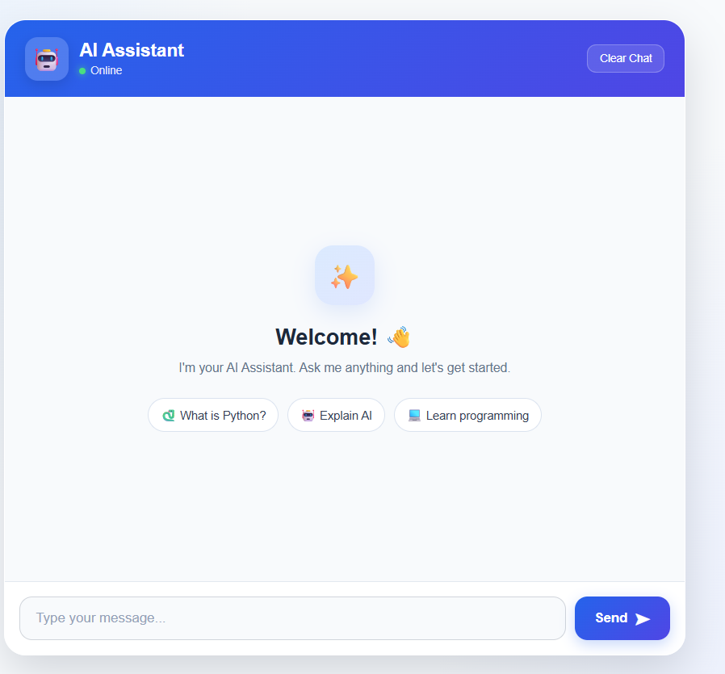
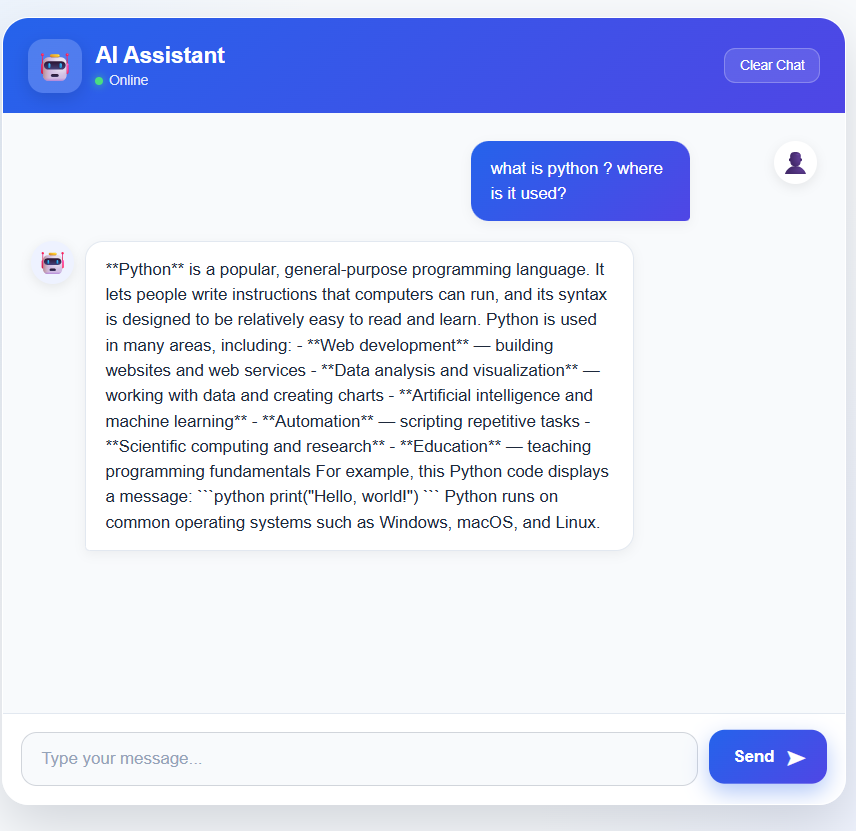
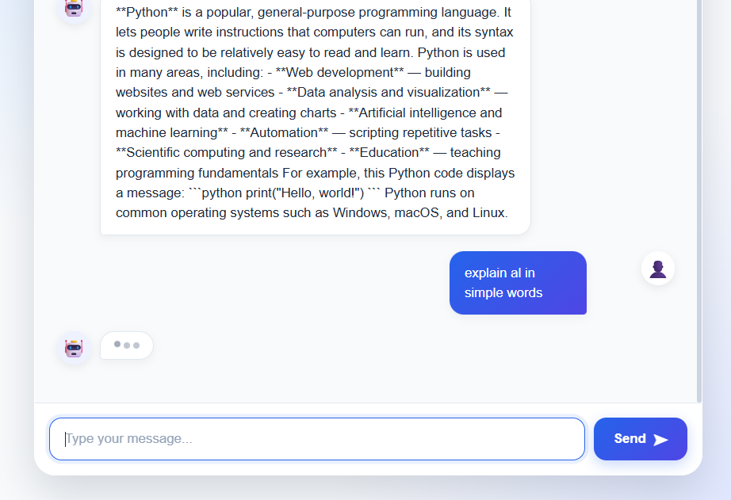
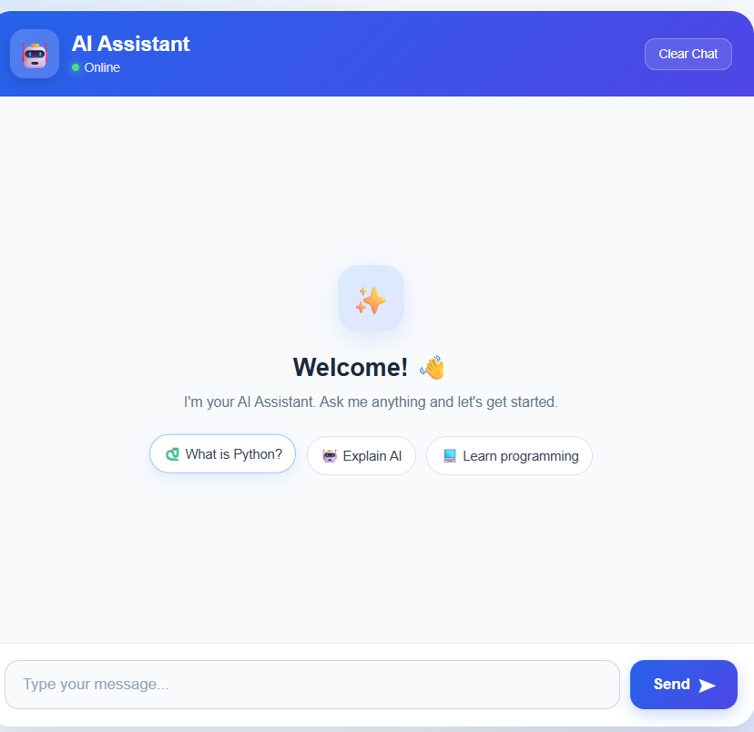
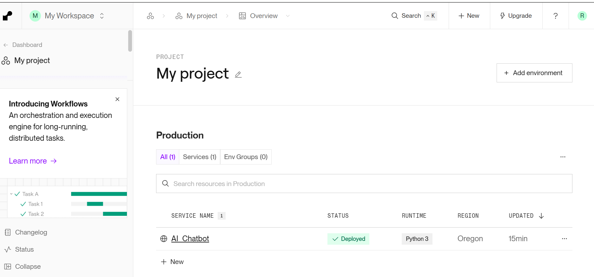

# 🤖 AI Chatbot Web Application

A modern AI-powered chatbot web application built using Python and Flask. Users can interact with an AI assistant through a clean and responsive chat interface.

## 🌐 Live Demo

[Open the Live AI Chatbot](https://ai-chatbot-qoem.onrender.com/)

## 📂 GitHub Repository

[View the Source Code](https://github.com/madhu100706/AI_Chatbot)

## ✨ Features

- 🤖 AI-powered chatbot
- 💬 Interactive chat interface
- 🧠 Conversation history during the session
- ⌨️ Typing/loading animation
- 🧹 Clear Chat functionality
- 💡 Suggested questions
- 📱 Responsive design
- 🔐 API key protected using environment variables
- 🌐 Deployed online using Render

## 🛠️ Technologies Used

- Python
- Flask
- OpenAI API
- HTML5
- CSS3
- JavaScript
- python-dotenv
- Gunicorn
- Git & GitHub
- Render


## 📸 Screenshots

### 🏠 Homepage



### 💬 Chatbot Conversation



### ⌨️ Typing Animation



### 🧹 Clear Chat



### 🚀 Deployment


## 📁 Project Structure

```text
AI_Chatbot/
│
├── app.py
├── requirements.txt
├── .gitignore
├── .env
│
├── templates/
│   └── index.html
│
├── static/
│   ├── css/
│   │   └── style.css
│   │
│   └── js/
│       └── script.js
│
└── screenshots/
    ├── homepage.png
    ├── conversation.png
    ├── typing-animation.png
    └── clear-chat.png

```

## How to Run Locally

### 1. Clone the repository
```bash
git clone https://github.com/madhu100706/AI_Chatbot
```

### 2. Open the project folder

```bash
cd AI_Chatbot
```


### 3. Install the required packages
```bash
pip install -r requirements.txt
```

### 4. Create the environment file

Create a .env file in the project folder and add:

OPENAI_API_KEY=your_api_key_here

### 5. Run the application
```bash
py app.py
```


Open the application in your browser at:

http://127.0.0.1:5000

**🚀 Deployment**

The application is deployed using Render and is connected to the GitHub repository.

**🎓 Internship Project**

This project was developed as part of the Python Programming Internship – Phase 1 at Sqrock IT Solutions.

**Project Objective**

The objective was to develop a modern AI Chatbot Web Application where users can interact with an AI assistant through a web-based chat interface.

**📚 Learning Experience**

Through this project, I practiced and learned:

Building web applications using Flask
Connecting a Python application with an AI API
Creating frontend interfaces using HTML and CSS
Using JavaScript for interactive web functionality
Handling API requests and responses
Managing environment variables securely
Using Git and GitHub for version control
Deploying a Python web application online

**👩‍💻Developer**

**Supriya Rai**

BCA Graduate | Python & Web Development Learner
